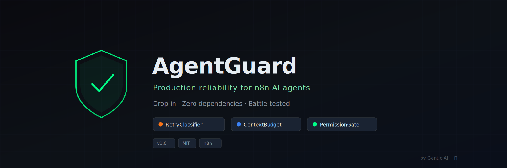
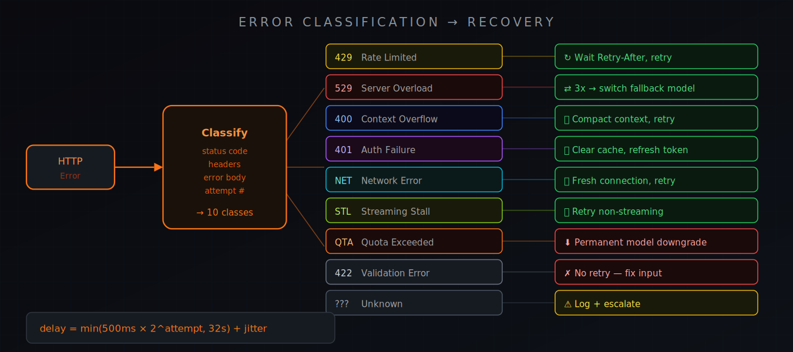
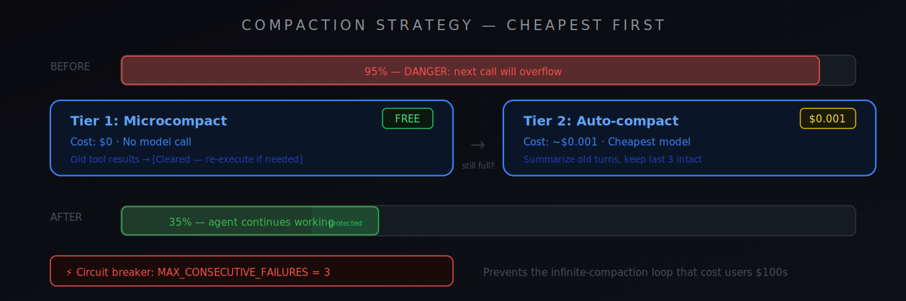

<p align="center">
  
</p>

<p align="center">
  <a href="https://github.com/gentic-ai/agentguard/stargazers"></a>
  <a href="https://github.com/gentic-ai/agentguard/network/members"></a>
  <a href="https://github.com/gentic-ai/agentguard/blob/main/LICENSE"></a>
  <a href="https://n8n.io"></a>
  <a href="https://github.com/gentic-ai/agentguard/commits/main"></a>
</p>

<p align="center">
  <strong>Your n8n agents are failing silently.</strong><br/>
  Context windows overflow. Rate limits crash without recovery. Tool outputs flood the conversation.<br/>
  <strong>AgentGuard fixes this in under 5 minutes — free, MIT, drop-in.</strong>
</p>

<p align="center">
  <a href="#quick-start"></a>
  <a href="./workflows/"></a>
  <a href="https://genticai.pro"></a>
</p>

---

## What's Inside

Three importable n8n sub-workflows. Use one, two, or all three:

| | Component | What it does | Deploy time |
|---|-----------|-------------|-------------|
| 🔄 | **[RetryClassifier](#-retryclassifier)** | 10-class error taxonomy. Specific recovery per error type, not generic retry. | 2 min |
| 📐 | **[ContextBudget](#-contextbudget)** | Tool result budgeting + two-tier compaction. Prevents silent context overflow. | 2 min |
| 🔒 | **[PermissionGate](#-permissiongate)** | Glob-pattern allow/deny/prompt per tool call. Full audit log. | 3 min |

---

## The Problem Nobody Talks About

The AI agent market hit **$7.84B** in 2025. Gartner predicts 40% of enterprise apps will have task-specific agents by end of 2026.

But here's what the frameworks don't ship:

> **No error classification.** A 429 rate limit needs a different recovery than a 400 context overflow. Most agents retry both the same way — or don't retry at all.

> **No context management.** One large tool result fills your context window. The model loses track. The agent hallucinates or crashes. You don't find out until a pipeline breaks.

> **No permission granularity.** Your agent either has full tool access or none. There's no middle ground between "can do anything" and "can do nothing."

These are the same problems Anthropic solved inside Claude Code with an **823-line retry system**, **four compaction strategies**, and a **seven-stage permission pipeline**.

**AgentGuard brings those patterns to n8n.**

---

## Quick Start

### 1. Import

```
n8n Settings → Import Workflow → Select JSON file
```

Download from [`/workflows`](./workflows/):
- [`retry-classifier.json`](./workflows/retry-classifier.json)
- [`context-budget.json`](./workflows/context-budget.json)
- [`permission-gate.json`](./workflows/permission-gate.json)

### 2. Wire

Add an **Execute Workflow** node in your agent workflow pointing to the AgentGuard sub-workflow:

```
[Your AI Agent] → [Execute Workflow: RetryClassifier] → [API Call]
[Tool Output]   → [Execute Workflow: ContextBudget]   → [Back to Agent]
[Tool Request]  → [Execute Workflow: PermissionGate]  → [Tool Execution]
```

### 3. Configure

Each component has a config object at the top of its Code node:

```javascript
// RetryClassifier — set your fallback model
const config = {
  maxRetries: 5,
  baseDelay: 500,
  maxDelay: 32000,
  fallbackModel: "gemma4:e4b",  // local Ollama = $0/call
  fallbackEndpoint: "http://localhost:11434/v1/chat/completions"
};

// ContextBudget — set your summary endpoint
const config = {
  maxResultChars: 8000,
  compactionThreshold: 0.80,
  summaryModel: "gemma4:e4b",
  summaryEndpoint: "http://localhost:11434/v1/chat/completions",  // update for cloud
  protectedTailTurns: 3
};

// PermissionGate — set default action
const config = {
  defaultAction: "prompt",  // "allow", "deny", or "prompt"
  auditLog: true,
  logDestination: "postgres"
};
```

---

## 🔄 RetryClassifier

<p align="center">
  
</p>

Not all errors are the same. RetryClassifier parses every HTTP failure and routes it to a specific recovery strategy:

| Error Class | Status | Recovery Strategy |
|-------------|--------|------------------|
| Rate Limited | 429 | Parse `Retry-After` header → wait exact duration |
| Server Overload | 529/503 | Track consecutive count → switch model after 3 |
| Context Overflow | 400 | Trigger ContextBudget compaction → retry |
| Auth Failure | 401/403 | Clear cache → refresh token → retry once |
| Network Error | ECONNRESET/timeout | Disable keep-alive → fresh connection |
| Quota Exceeded | 429 + overage flag | Permanent model downgrade → notify operator |
| Input Validation | 422 | Log → fail (no retry — fix the input) |
| Streaming Stall | timeout (no chunks) | Abort → retry non-streaming |
| Unknown | * | Escalate to error workflow |

**Backoff formula:** `min(500ms × 2^attempt, 32s) + random jitter` — no thundering herd.

**Model fallback chain:**
```
Claude Haiku → Gemini Flash → Local Ollama (gemma4:e4b) → Fail gracefully
```

When your primary API is rate-limited or down, your agent keeps working on local inference at $0/call.

[Full docs →](./docs/retry-classifier.md)

---

## 📐 ContextBudget

<p align="center">
  
</p>

**Two problems. One component. Zero dollars for Tier 1.**

**Problem 1:** Your agent runs a web scrape that returns 50KB. That's ~12,500 tokens — half your context window, gone on one tool call.

**Problem 2:** After 15 turns, your context is full. The next API call fails or the model loses coherence.

**Solution: Two-tier compaction, cheapest first**

| Tier | Trigger | Cost | What Happens |
|------|---------|------|-------------|
| **Microcompact** | Every turn | **$0** | Old tool results cleared, file ref saved |
| **Auto-compact** | Context > 80% | **~$0.001** | History summarized by cheapest model |

**The circuit breaker** (`MAX_CONSECUTIVE_COMPACTION_FAILURES = 3`) prevents the infinite-compaction loop that cost real users hundreds of dollars in wasted API calls before they noticed.

[Full docs →](./docs/context-budget.md)

---

## 🔒 PermissionGate

Your agent has access to Bash, HTTP, database, and file tools. Right now it's all-or-nothing. PermissionGate adds **glob-pattern matching** on every tool call:

```json
{ "tool": "bash",     "pattern": "ls *",        "action": "allow"  },
{ "tool": "bash",     "pattern": "rm -rf*",      "action": "deny"   },
{ "tool": "bash",     "pattern": "git push*",    "action": "prompt" },
{ "tool": "database", "pattern": "SELECT *",     "action": "allow"  },
{ "tool": "database", "pattern": "DROP *",       "action": "deny"   },
{ "tool": "http",     "pattern": "DELETE *",     "action": "deny"   },
{ "tool": "*",        "pattern": "*",            "action": "prompt" }
```

**Three modes:**

| Mode | Behavior |
|------|----------|
| `allow` | Execute immediately + log |
| `deny` | Block + return structured error to model |
| `prompt` | Hold + notify operator (Slack/Telegram/webhook) + wait for approval |

Every decision logged. Enterprise-ready audit trail.

[Full docs →](./docs/permission-gate.md)

---

## Architecture

<p align="center">
  
</p>

Each component is a **standalone sub-workflow**. They compose but don't depend on each other. Add one at a time — start with RetryClassifier (biggest immediate impact), then ContextBudget, then PermissionGate.

Full integration patterns in [integration-guide.md](./integration-guide.md).

---

## Compatibility

| | Support |
|:--|:--------|
| **n8n** | 1.70+ (full) · 1.50–1.69 (no streaming) |
| **LLM Providers** | OpenAI · Anthropic · Google · Groq · Ollama · Azure · any OpenAI-compatible endpoint |
| **Agent Types** | Tools Agent · OpenAI Functions Agent · ReAct Agent · Custom Agent |
| **Self-hosted** | Yes — runs entirely on your infrastructure, zero external dependencies |

---

## Why Open Source?

We run **55 active workflows** across three businesses — real estate investment, AI automation, and voice AI scheduling. Every pattern here was extracted from a real production failure: a rate limit crash that lost a lead, a context overflow that corrupted a pipeline, an agent that ran `rm -rf` on a staging server.

We got tired of it. We built the reliability layer. Then we open-sourced it.

**Built by [Gentic AI](https://genticai.pro)** — production AI infrastructure for businesses that can't afford agents that fail silently.

---

## Want More?

AgentGuard is the free foundation. If you need the full stack:

| | AgentGuard | Managed Stack |
|:--|:-----------|:--------------|
| RetryClassifier | ✅ | ✅ |
| ContextBudget | ✅ | ✅ |
| PermissionGate | ✅ | ✅ |
| Trust Dashboard | — | Real-time agent monitoring UI |
| Multi-agent orchestration | — | Coordinated sub-agent execution |
| Voice AI integration | — | Pipecat voice stack, sub-$0.05/call |
| MoE model routing | — | Smart router, local inference priority |
| Dedicated support | — | Direct Slack channel |
| **Price** | **Free** | **[Let's talk →](https://genticai.pro)** |

**Premium n8n templates** — [gentic-n8n.deals](https://gentic-n8n.deals)
**Managed agents ($50/mo)** — [solo.genticai.pro](https://solo.genticai.pro)
**Enterprise infrastructure** — [genticai.pro](https://genticai.pro)

---

## Contributing

PRs welcome. If you've hit an agent failure mode we haven't covered, open an issue with the error output and we'll add a recovery strategy.

```bash
git clone https://github.com/gentic-ai/agentguard.git
cd agentguard
# Import workflows into your n8n instance
# Break things. Improve them. Open a PR.
```

---

## Star History

[](https://star-history.com/#gentic-ai/agentguard&Date)

---

<p align="center">
  <sub>MIT licensed · Built with 🦞 by <a href="https://genticai.pro">Gentic AI</a> in Las Vegas</sub>
</p>
